# Procesverslag
Markdown is een simpele manier om HTML te schrijven.  
Markdown cheat cheet: [Hulp bij het schrijven van Markdown](https://github.com/adam-p/markdown-here/wiki/Markdown-Cheatsheet).

Nb. De standaardstructuur en de spartaanse opmaak van de README.md zijn helemaal prima. Het gaat om de inhoud van je procesverslag. Besteedt de tijd voor pracht en praal aan je website.

Nb. Door *open* toe te voegen aan een *details* element kun je deze standaard open zetten. Fijn om dat steeds voor de relevante stuk(ken) te doen.

## Jij

  
uitwerken voor kick-off werkgroep

  ### Auteur:
  Penelope Smeltekop 

  #### Je startniveau:
  blauw

  #### Je focus:
  ik ga focussen op de surface plane
 

## Je website

  
uitwerken voor kick-off werkgroep

  ### Je opdracht:
  https://www.toogoodtogo.com/nl?utm_medium=search&utm_source=google&utm_campaign=nl_b2b_paid_marketing_search_google_brand&utm_content=107462129237&utm_term=too+good+to+go&gad_source=1&gclid=Cj0KCQjwiuC2BhDSARIsALOVfBIQx-Hxakzb3bNnyuLnWJZUGOHh68nJMyCFiz7AUjDGNmP0BUl8vOIaAsOUEALw_wcB

  #### Screenshot(s) van de eerste pagina (small screen): 
  hier de naam van de pagina  
  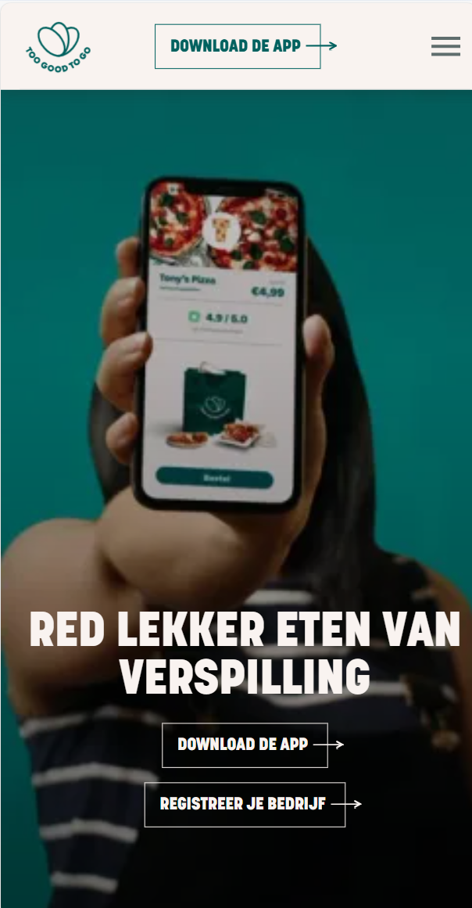

  #### Screenshot(s) van de tweede pagina (small screen):
  hier de naam van de pagina  
  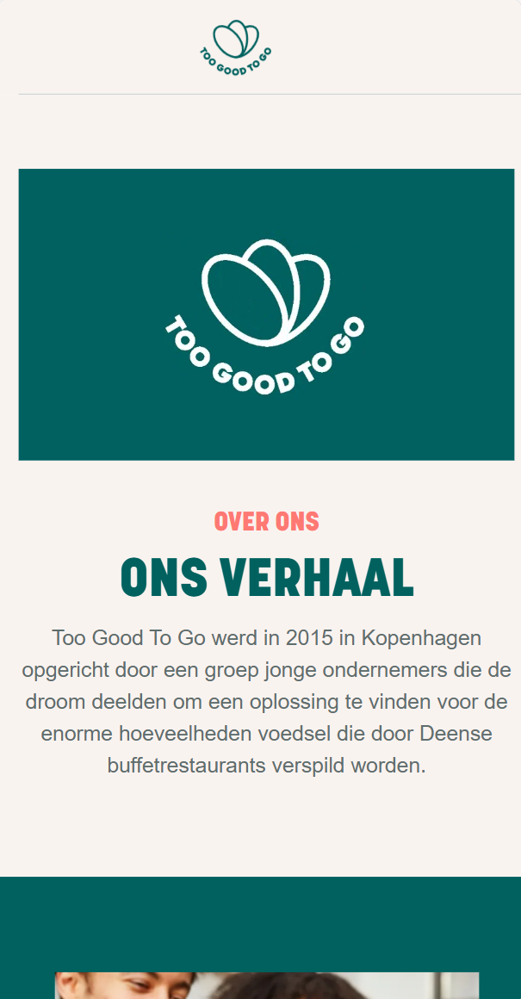
 

## Toegankelijkheidstest 1/2 (week 1)

  
uitwerken na afloop 2e werkgroep

  ### Bevindingen
  Lijst met je bevindingen die in de test naar voren kwamen:
  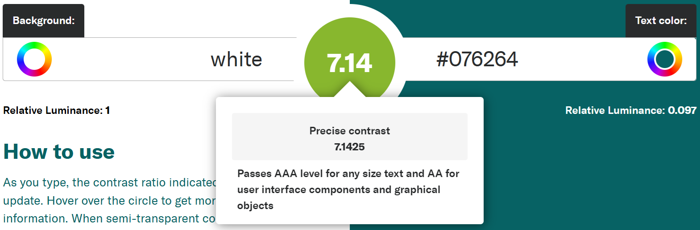
  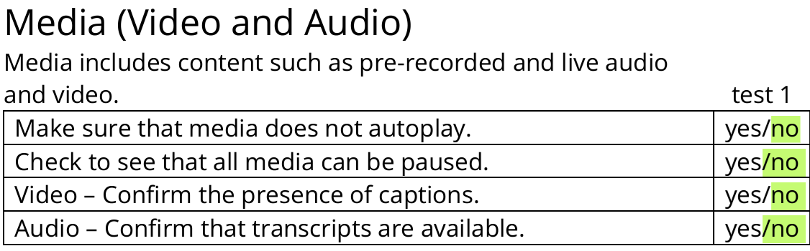
   mijn kleuren(#f8f8f8 en #076264) scoorde een 7,14 ''Passes AA level for any size text, AAA for large text (above 18pt or bold above 14pt), and AA for user interface components and graphical objects''
Hieruit heb ik gehaald dat ik de kleur #076264 voor elke soort tekst kan gebruiken kopjes maar ook content van de artikelen. Toen ik de screenreader gebruikte merkte ik dat ik een plaatje heb gemaakt waar je op kan klikken maar de screenreader pikt dat niet op. Dat is dus niet zo handig voor slechtziende. Ik ga ook dus een knop toevoegen bij dat draaiende plaatje zodat het ook duidelijk is voor slechtziende. Ik was ook vergeten overal een alt toe te voegen dus dat heb ik ook even gedaan. Ik heb gemerkt dat ik bij het media gedeelte alleen maar nee heb aangekruist maar in mijn opinie zijn al die dingen onnodig voor mijn website, omdat de video alleen decoratief is.

## Breakdownschets (week 1)

  
uitwerken na afloop 3 werkgroep

  ### de hele pagina: 
  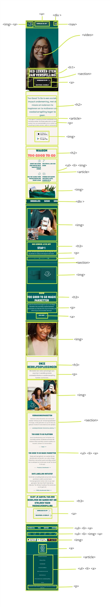

  ### dynamisch deel (bijv menu): 
  dit plaatje kan omdraaien maar is ga er een knop aan toevoegen
  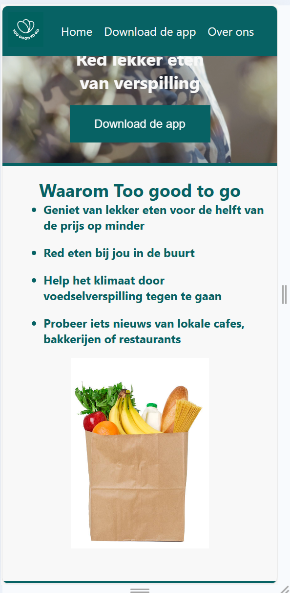

  ### wellicht nog een dynamisch deel (bijv filter): 
  dit is een automatisch afspelende filmpje
  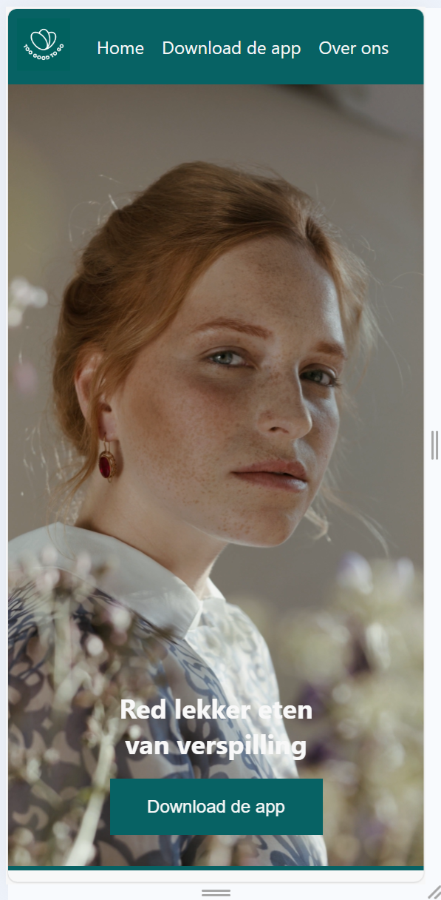

## Voortgang 1 (week 2)

  
uitwerken voor 1e voortgang

  ### Stand van zaken
  ik vond dat ik het wel mooi had gemaakt maar ik begreep niet hoe ik elementen op het scherm kon laten passen, het stak allemaal uit (neem ook screenshots op van delen van je website en code)

  ### Agenda voor meeting
  samen met je groepje opstellen

  | student 1      | student 2          | student 3    | student 4        |
  | ---            | ---                | ---          | ---              |
  | je gebruikt te | er steekt wat uit  | voeg animatie| je hebt nog geen |
  | veel divs en   | waardoor je rechts | of andere    | 2de pagina       |
  | classes        | kan scrollen       | elementen toe|                  |

  ### Verslag van meeting
  hier na afloop snel de uitkomsten van de meeting vastleggen

  - minder divs en classes gebruiken
  - niks meer uitsteken
  - animatie proberen
  - 2de pagina maken

## Voortgang 2 (week 3)

  
uitwerken voor 2e voortgang

  ### Stand van zaken
  ik had op internet opgezocht hoe ik een animatie kon toevoegen en ik begreep er helemaal niks van ik had toen geleerd over keyframes en dat het best makkelijk is eigenlijk
    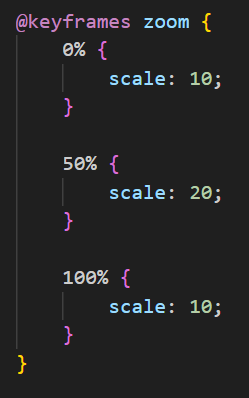

  ### Agenda voor meeting
  samen met je groepje opstellen

  | student 1      | student 2          | student 3    | student 4        |
  | ---            | ---                | ---          | ---              |
  | meer opdrachten| misschien een      | je kan een   | je mist je 2de   |
  | van de les     | animatie toevoegen | light/dark   | pagina nog       |
  | erbij doen     |                    | mode toevoegen|                 |

  ### Verslag van meeting
  hier na afloop snel de uitkomsten van de meeting vastleggen

  - op dlo kijken als ik daarvan iets kan toevoegen
  - light/dark mode toevoegen
  - 2de pagina maken

## Toegankelijkheidstest 2/2 (week 4)

  
uitwerken na test in 9e werkgroep

  ### Bevindingen
  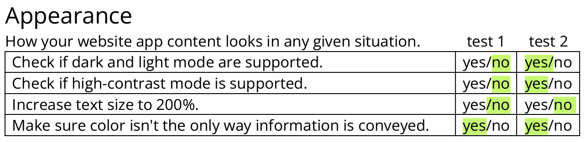
  Ik heb een light/dark mode toegevoegd de kleuren daarvoor zijn zwart en wit dus goed zichtbaar. Maar voor de rest verliep het allemaal goed. Als ik meer tijd had zou ik het mogelijk willen maken om de tekst te vergroten. Maar dat hoort meer bij responsive design en ik heb gekozen voor de surface plane.

## Voortgang 3 (week 4)

  
uitwerken voor 3e voortgang

  ### Stand van zaken
  ik vond het lastig om alles in het midden te zetten. sons begreep ik niet waarom het bij de ene wel in het midden gaat en de andere niet
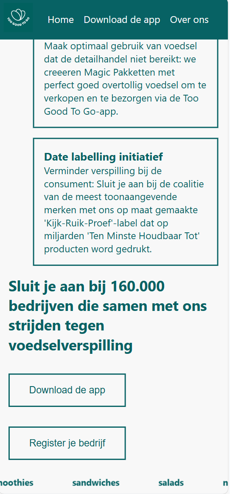

  ### Agenda voor meeting
  samen met je groepje opstellen

  | student 1      | student 2          | student 3    | student 4        |
  | ---            | ---                | ---          | ---              |
  | light/dark mode| er is geen footer  | niet alles is| ruimtes tussen   |
  | werkt nog niet |                    | gecentreed   | dingen verschillen|
  |                |                    |              |                  |

  ### Verslag van meeting
  hier na afloop snel de uitkomsten van de meeting vastleggen

  - light/dark mode werkend maken
  - footer toevoegen
  - alles in het midden
  - overal zelfde witruimte tussen

## Eindgesprek (week 5)

  
uitwerken voor eindgesprek

  ### Je uitkomst - karakteristiek screenshots:
  

  ### Dit ging goed/Heb ik geleerd: 
  ik het de fotos geanimeerd dit heb ik geleerd door de opdrachten op dlo

  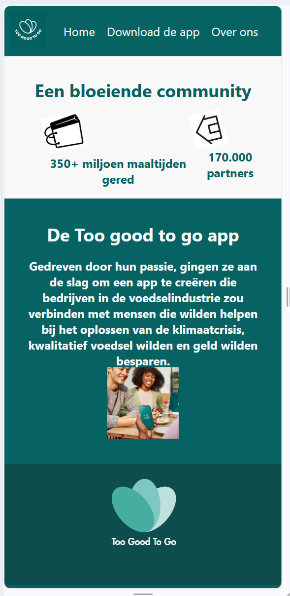

  ### Dit was lastig/Is niet gelukt:
  ik heb van deze plaatjes een carousel gemaakt maar ik vond het lastig ik heb het van internet zie bronnenlijst

  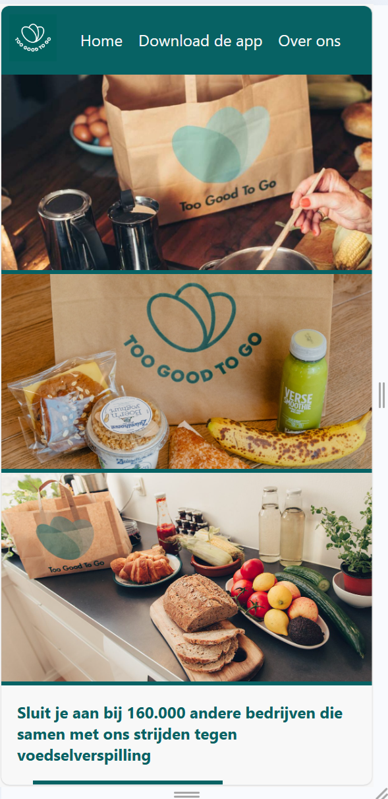

## Bronnenlijst

  
continu bijhouden terwijl je werkt

  Nb. Wees specifiek ('css-tricks' als bron is bijv. niet specifiek genoeg). 
  Nb. ChatGpT en andere AI horen er ook bij.
  Nb. Vermeld de bronnen ook in je code.

  1. voor social media iconen https://www.javatpoint.com/how-to-add-social-media-icons-in-html?utm_content=cmp-true
  2. https://medium.com/@archielister/make-an-infinitely-scrolling-banner-with-html-and-css-e7918506c496
  3. https://www.w3schools.com/howto/howto_website.asp

